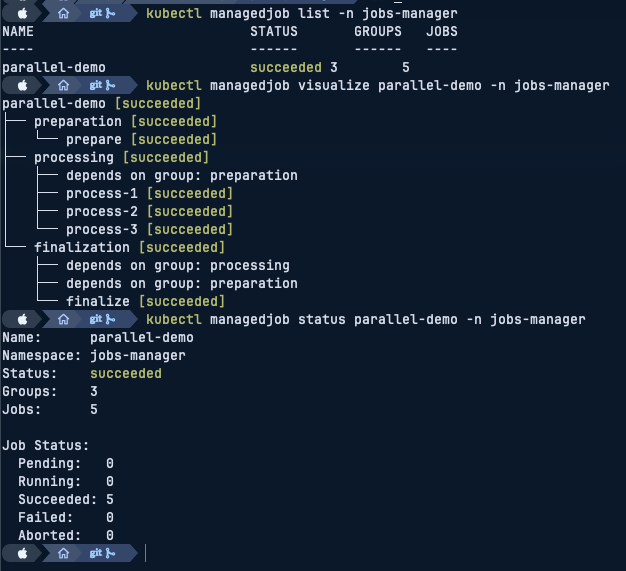

# Kubernetes Jobs Manager Operator

- [Kubernetes Jobs Manager Operator](#kubernetes-jobs-manager-operator)
  - [Description](#description)
  - [Features](#features)
  - [Getting Started](#getting-started)
    - [Installation with helm](#installation-with-helm)
    - [Prerequisites for local runs](#prerequisites-for-local-runs)
    - [Jobs configuration](#jobs-configuration)
    - [Examples](#examples)
    - [How does it look in practice?](#how-does-it-look-in-practice)
    - [Things to remember](#things-to-remember)
    - [Available params](#available-params)
    - [Resource limits](#resource-limits)
    - [Kustomization and references](#kustomization-and-references)
    - [Running on the cluster](#running-on-the-cluster)
      - [Manual installation](#manual-installation)
      - [Manually uninstall CRDs](#manually-uninstall-crds)
    - [Manually undeploy controller](#manually-undeploy-controller)
    - [How it works](#how-it-works)
  - [kubectl Plugin](#kubectl-plugin)
  - [Observability](#observability)
    - [Prometheus Metrics](#prometheus-metrics)
    - [ServiceMonitor](#servicemonitor)
  - [Configuration](#configuration)
  - [License](#license)


## Description
This operator is responsible for managing the lifecycle of complicated workflows which consist of multiple jobs and making their management easy, without need for dozens of yaml files and doing magic with ordering.

## Features

- **Workflow orchestration** - Define complex job workflows with dependency management
- **Parameter inheritance** - DRY configuration with params merged from workflow → group → job levels
- **Parallel execution** - Run jobs in parallel within groups or sequentially with dependencies
- **Prometheus metrics** - Built-in observability with metrics for jobs created/succeeded/failed, active jobs count, and reconciliation duration
- **Resource limits** - Configure CPU and memory limits for job containers
- **Finalizers** - Proper cleanup of child jobs when ManagedJob resources are deleted
- **kubectl plugin** - Visualize job dependency graphs directly from the command line
- **O(1) dependency lookup** - Optimized performance for large workflows

## Getting Started

### Installation with helm

```sh
helm repo add raczylo https://lukaszraczylo.github.io/helm-charts/
helm repo update raczylo
helm install jobs-manager raczylo/jobs-manager
```

### Prerequisites for local runs
- [go](https://golang.org/dl/) v1.16+
- [kustomize](https://sigs.k8s.io/kustomize/docs/INSTALL.md) v3.5.4+
- [docker](https://docs.docker.com/install/) v19.03.8+
- [kubectl](https://kubernetes.io/docs/tasks/tools/install-kubectl/) v1.18.2+

### Jobs configuration

```yaml
apiVersion: jobsmanager.raczylo.com/v1beta1
kind: ManagedJob
metadata:
  labels:
  name: managedjob-sample
spec:
  retries: 3
  params:
    env:
      - name: "FOO"
        value: "bar"
      - name: "QUE"
        value: "pasa"

  # Job groups definitions
  groups:
    - name: "first-group"
      parallel: true
      params:
        env:
          - name: "FEE"
            value: "bee"
      jobs:
        - name: "first-job"
          image: "busybox"
          args:
            - "echo"
            - "Hello world!"
          params:
            env:
              - name: "POO"
                value: "paz"

        - name: "second-job"
          image: "busybox"
          args:
            - "sleep"
            - "10"
        - name: "second-half-job"
          image: "busybox"
          args:
            - "sleep"
            - "10"

    - name: "second-group"
      parallel: true
      jobs:
        - name: "third-job"
          image: "busybox"
          args:
            - "echo"
            - "Hello world!"
          parallel: true

        - name: "fourth-job"
          image: "busybox"
          args:
            - "sleep"
            - "10"
          parallel: false

    - name: "third-group"
      parallel: false
      jobs:
        - name: "fifth-job"
          image: "busybox"
          args:
            - "echo"
            - "Hello world!"
          parallel: true
```

### Examples

More example manifests are available in the [`config/samples/`](config/samples/) directory:

| Example | Description |
|---------|-------------|
| [Quick Start](config/samples/managedjob_quickstart.yaml) | Simple "Hello World" with two sequential jobs |
| [Parallel Processing](config/samples/managedjob_parallel_example.yaml) | Fan-out/fan-in pattern with parallel job execution |
| [Comprehensive Demo](config/samples/managedjob_comprehensive_example.yaml) | Full-featured example showcasing all capabilities: ConfigMaps, Secrets, volumes, resource limits, multi-group dependencies, and parameter inheritance |

### How does it look in practice?

```yaml
managedjob-sample
├── first-group
│   ├── first-job
│   ├── second-job
│   │   └── Depends on: managedjob-sample-first-group-first-job
│   └── second-half-job
│       ├── Depends on: managedjob-sample-first-group-first-job
│       └── Depends on: managedjob-sample-first-group-second-job
├── second-group
│   ├── third-job
│   └── fourth-job
│       └── Depends on: managedjob-sample-second-group-third-job
└── third-group
    ├── fifth-job
    ├── Depends on group: first-group
    └── Depends on group: second-group
```

If dependency exists on the group level - the group will not be executed until all of remaining groups have finished successfuly.
If dependency exists on the job level - the job will not be executed until all of remaining jobs have finished successfuly.
Remember that **ORDER matters**.

### Things to remember

Parameters **params** are always merged downwards to DRY your definitions.
In this case - result for the first job will look like this:

```yaml
    - jobs:
      - args:
        - echo
        - Hello world!
        compiledParams:
          env:
          - name: POO
            value: paz
          - name: FEE
            value: bee
          - name: FOO
            value: bar
          - name: QUE
            value: pasa
        image: busybox
        name: first-job
        parallel: false
        status: succeeded
```

### Available params

There's quite a lot of of flexibility with parameters. On every level where params are allowed, you can define:

```yaml
params:
  fromEnv:
    - configMapRef:
        name: "configmap-name"
      key: "key-name"
  env:
    - name: "FOO"
      value: "bar"
  volumes:
    - name: secrets-store-api
      csi:
        driver: secrets-store.csi.k8s.io
        readOnly: true
        volumeAttributes:
          secretProviderClass: api-secrets-provider
  volumeMount:
    - name: secrets-store-api
      mountPath: "/mnt/secrets-api"
      readOnly: true
  serviceAccount: "service-account-name"
  restartPolicy: "Never"
  imagePullSecrets:
    - "ghcr-token"
  imagePullPolicy:
    - "Always"
  labels:
    this/works: "true"
  annotations:
    this/works/aswell: "true"
  resources:
    limits:
      cpu: "500m"
      memory: "256Mi"
    requests:
      cpu: "100m"
      memory: "128Mi"
```

### Resource limits

You can configure resource limits for job containers at any level (workflow, group, or job). These follow the standard Kubernetes resource requirements:

```yaml
params:
  resources:
    limits:
      cpu: "1"
      memory: "512Mi"
    requests:
      cpu: "250m"
      memory: "128Mi"
```

### Kustomization and references

In case of any issues with `configmapGenerator` or `secretGenerator`, please add following to your `kustomization.yaml`:

```yaml
configurations:
  - crd-name-reference.yaml
```

Then you can create `crd-name-reference.yaml` file with following content:

```yaml
---
nameReference:
  - kind: 'ConfigMap'
    fieldSpecs:
      - kind: 'ManagedJob'
        path: 'spec/params/fromEnv[]/configMapRef/name'
      - kind: 'ManagedJob'
        path: 'spec/params/env[]/configMapRef/name'
```

This will instruct kustomize to replace all references to configmaps with their names if they are managed by generators.

### Running on the cluster

#### Manual installation
1. Install Instances of Custom Resources:

```sh
kubectl apply -f config/samples/
```

2. Build and push your image to the location specified by `IMG`:

```sh
make docker-build docker-push IMG=ghcr.io/lukaszraczylo/jobs-manager-operator:tag
```

3. Deploy the controller to the cluster with the image specified by `IMG`:

```sh
make deploy IMG=ghcr.io/lukaszraczylo/jobs-manager-operator:tag
```

#### Manually uninstall CRDs
To delete the CRDs from the cluster:

```sh
make uninstall
```

### Manually undeploy controller
UnDeploy the controller from the cluster:

```sh
make undeploy
```


### How it works
This project aims to follow the Kubernetes [Operator pattern](https://kubernetes.io/docs/concepts/extend-kubernetes/operator/).

It uses [Controllers](https://kubernetes.io/docs/concepts/architecture/controller/),
which provide a reconcile function responsible for synchronizing resources until the desired state is reached on the cluster.

## kubectl Plugin

The operator includes a kubectl plugin for visualizing job dependency graphs. Install it using the provided script:

```sh
curl -sSL https://raw.githubusercontent.com/lukaszraczylo/jobs-manager-operator/main/scripts/install-plugin.sh | bash
```

Once installed, you can visualize ManagedJob workflows:

```sh
# Visualize a ManagedJob workflow as an ASCII tree with status colors
kubectl managedjob visualize <managedjob-name> -n <namespace>

# Watch mode - continuously update the visualization
kubectl managedjob visualize <managedjob-name> -w

# Show all ManagedJobs in a namespace
kubectl managedjob list -n <namespace>

# Show status summary for a specific workflow
kubectl managedjob status <managedjob-name> -n <namespace>
```

Status colors in the visualization:
- **Green**: succeeded
- **Yellow**: running
- **Red**: failed
- **Gray**: pending



## Observability

### Prometheus Metrics

The operator exposes the following Prometheus metrics:

| Metric | Type | Labels | Description |
|--------|------|--------|-------------|
| `managedjob_jobs_created_total` | Counter | namespace, workflow, group | Total number of jobs created |
| `managedjob_jobs_succeeded_total` | Counter | namespace, workflow, group | Total number of jobs that succeeded |
| `managedjob_jobs_failed_total` | Counter | namespace, workflow, group | Total number of jobs that failed |
| `managedjob_active_jobs` | Gauge | namespace, workflow | Current number of active jobs |
| `managedjob_reconciliation_duration_seconds` | Histogram | namespace, workflow | Time taken for reconciliation |

### ServiceMonitor

If you're using the Prometheus Operator, a ServiceMonitor is included in the Helm chart. Enable it in your values:

```yaml
serviceMonitor:
  enabled: true
  interval: 30s
  labels: {}
```

## Configuration

The operator supports the following configuration options:

| Flag | Environment Variable | Description | Default |
|------|---------------------|-------------|---------|
| `--leader-election-id` | - | Custom leader election ID | `jobs-manager-operator` |
| `--dev-mode` | - | Enable development logging mode | `false` |
| - | `LOG_LEVEL` | Logging level (debug, info, warn, error) | `info` |

Example Helm values for configuration:

```yaml
controllerManager:
  manager:
    leaderElectionId: "my-custom-id"
    devMode: true
    env:
      LOG_LEVEL: "debug"
```

## License

Copyright 2023-2025.

Licensed under the Apache License, Version 2.0 (the "License");
you may not use this file except in compliance with the License.
You may obtain a copy of the License at

    http://www.apache.org/licenses/LICENSE-2.0

Unless required by applicable law or agreed to in writing, software
distributed under the License is distributed on an "AS IS" BASIS,
WITHOUT WARRANTIES OR CONDITIONS OF ANY KIND, either express or implied.
See the License for the specific language governing permissions and
limitations under the License.
